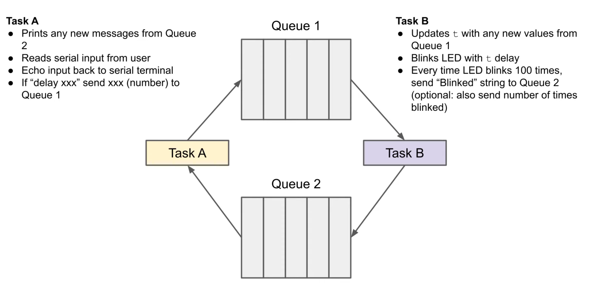

This github repo documents my approach to the Digikey's Freertos [Queue Challenge](https://youtu.be/pHJ3lxOoWeI?list=PLEBQazB0HUyQ4hAPU1cJED6t3DU0h34bz). Official solution is [here](https://www.youtube.com/redirect?event=video_description&redir_token=QUFFLUhqblBfbGxIdFBlblFWdmJYOTdQdmhxUmdoRzdKd3xBQ3Jtc0ttNTVpaTlRWkxINVd4R2hCX3lGdGJwVVlZOGtmZ1RNQlRQZjYzOVEzdlFmaFpXaURUUXVTcHdFejl2RGc2a1B2NUZWVFNBSVhIcEl3MXdfZktQZ0ZRX2NWNngydFpBc2IydjFPUG00VGhJc0RzeGQ0Zw&q=https%3A%2F%2Fwww.digikey.com%2Fen%2Fmaker%2Fprojects%2Fintroduction-to-rtos-solution-to-part-5-freertos-queue-example%2F72d2b361f7b94e0691d947c7c29a03c9&v=pHJ3lxOoWeI).

The goal was to learn about FreeRTOS queue operation basics. Here's the overview of the tasks that needed to be implemented:

SIDE NOTE:
- I used ESP-IDF instead of Arduino IDE for greater control over timer functionality. I started off with Arduino IDE, but at some point got stuck because when attempting to use a timer for a timed read of the delay command, the timer did not restart for subsequent delay commands. I thought it would be easier to debug without extra layer of abstraction posed by Arduino IDE's esp32 toolchain library. I did not encounter the same problem in ESP-IDF, so I can't tell what was wrong exactly.

Config Setup: All is default for ESP32 except for the following.
- CONFIG_FREERTOS_UNICORE enabled
- CONFIG_UART_ISR_IN_IRAM is enabled

## Testing
Preliminary notes: `delay <num>`
- `delay <num>` should have single space separation between `delay` and `<num>`.
- `<num>` is only valid for numeric characters.
- If type, `ddeldelay 500` -> delay command detected, if timely manner and 500 is followed by a whitespace character.
	- However, if `<num>` is UINT32_MAX or greater, then no whitespace needed at the end for `delay <num>` to be detected or dismissed.
		- If `<num>` == UINT32_MAX, delay is set to UINT32_MAX.
		- If greater than UINT32_MAX, then delay is not changed from its previous value.
- If `delay <num>` commands get input in quick succession, as in the blink_task is still in blocked state following the first `delay <num>` by the time the second one arrives, then the second `delay <num>` overrides the first one, ie blink_task gets unblocked and retrieves the second delay number.

Preliminary notes: `Blinked <led_count>`
- If new delay number comes in, `<led_count>` does not reset, it increments at a different pace.

### delay_num is 500 ms (initial value), delay command timeout

| Test Description/Name                                                         | Steps                                                                                                                                                                                                                                                                                                                                                                                                                                                                                                                                        | Expected Behavior                                                                                                                                                                 | Result |
| ----------------------------------------------------------------------------- | -------------------------------------------------------------------------------------------------------------------------------------------------------------------------------------------------------------------------------------------------------------------------------------------------------------------------------------------------------------------------------------------------------------------------------------------------------------------------------------------------------------------------------------------- | --------------------------------------------------------------------------------------------------------------------------------------------------------------------------------- | ------ |
| Timeout trigger because of `delay <num>`'s unfinished `delay`  command input. | 1. Flash esp32 + launch monitor. 2. Start typing `delay` (but don't finish, let it hang) before the first `Blinked <num>` log gets output to serial monitor from the delay_task. 3. Make sure the log level is set to debug to see blink_task logs of roughly how many times LED blinked during `delay <num>` input period. These logs are needed for comparison, once `delay <num>` times out, to check if all the queued `Blinked <num>` logs get flushed properly to serial monitor from delay_task.                                | `Delay timeout` is output to the console, and all the `Blinked <num>` that have been sent to Queue2 during stagnant `delay <num>` command input get flushed to serial monitor.    | PASS   |
| Timeout trigger because of `delay <num>`'s unfinished `<num>` arg input.      | 1. Flash esp32 + launch monitor. 2. Input `delay ` to serial monitor before the first `Blinked <num>` log gets output to serial monitor from the delay_task. Start inputting the `<num>` arg, but don't finish. 3. Make sure the log level is set to debug to see blink_task logs of roughly how many times LED blinked during `delay <num>` input period. These logs are needed for comparison, once `delay <num>` times out, to check if all the queued `Blinked <num>` logs get flushed properly to serial monitor from delay_task. | Ditto. Also, the unfinished `<num>` arg that was being input before timeout should be disregarded and previous delay num (or initial value) should be used for LED blink_task. | PASS   |

### delay num timeout, different queue_len and queue_len_near_full
| Test Description/Name                                                         | Steps                                                                                                                                                                                                                                                                                                                                                                                                                                                                                                                                                                              | Expected Behavior                                                                                                                                                              | Result |
| ----------------------------------------------------------------------------- | ---------------------------------------------------------------------------------------------------------------------------------------------------------------------------------------------------------------------------------------------------------------------------------------------------------------------------------------------------------------------------------------------------------------------------------------------------------------------------------------------------------------------------------------------------------------------------------- | ------------------------------------------------------------------------------------------------------------------------------------------------------------------------------ | ------ |
| Timeout trigger because of `delay <num>`'s unfinished `delay`  command input. | 1. Change queue_len and queue_len_near_full to different values.  2. Flash esp32 + launch monitor. 3. Start typing `delay` (but don't finish, let it hang) before the first `Blinked <num>` log gets output to serial monitor from the delay_task. 4. Make sure the log level is set to debug to see blink_task logs of roughly how many times LED blinked during `delay <num>` input period. These logs are needed for comparison, once `delay <num>` times out, to check if all the queued `Blinked <num>` logs get flushed properly to serial monitor from delay_task. | `Delay timeout` is output to the console, and all the `Blinked <num>` that have been sent to Queue2 during stagnant `delay <num>` command input get flushed to serial monitor. | PASS   |
### delay num correct test

| Test                  | Steps                                                                                           | Expected Behavior                                                                                          | Result |
| --------------------- | ----------------------------------------------------------------------------------------------- | ---------------------------------------------------------------------------------------------------------- | ------ |
| Quick succession test | Input the following commands in quick succession `delay 5000` `delay 1000` `delay 500` | `[QUEUE] : in blink_task, delay number is <num>` should be output for 5000, 1000 and 500 in timely manner. | PASS   |
### delay num incorrect test
| Test                            | Steps                                                                                  | Expected Behavior                                                                                                                                                                                                                                                                                                    | Result |
| ------------------------------- | -------------------------------------------------------------------------------------- | -------------------------------------------------------------------------------------------------------------------------------------------------------------------------------------------------------------------------------------------------------------------------------------------------------------------- | ------ |
| Wrong cmd word (delay)          | Input something that starts with `d` but is not `delay`.                               | Should output `[QUEUE] : Not delay or missing delay num` log to serial monitor. If the input command starts wit letters of `delay`, followed by another `d`, the program will not consider it a wrong word. Instead it will wait for a delay command to be input, e.g. `deld` -> wait for remaining `elay` chars. | PASS   |
| Wrong format,  `<num>`          | Input `delay <num>` where num has non-numeric characters (excluding whitespace/LF/CR). | `[QUEUE] : Not delay or missing delay num` is output to console. delay number is not updated in the blink task.                                                                                                                                                                                                      | PASS   |
| delay followed by LN/CR/`<tab>` | Input `delay` followed directly by LN/CR/`<tab>`                                       | `[QUEUE] : Not delay or missing delay num` is output to console. delay number is not updated in the blink task.                                                                                                                                                                                                      | PASS   |

### different BLINK_COUNT_INTERVAL
| Test                    | Steps                                              | Expected Behavior                              | Result |
| ----------------------- | -------------------------------------------------- | ---------------------------------------------- | ------ |
| BLINK_COUNT_INTERVAL=15 | Set BLINK_COUNT_INTERVAL to 15, rebuild and flash. | Output: `Blinked 15` `Blinked 30` ... | PASS   |

## sources
There are more sources, but I forgot to link all of them.
- [ESP Timers Espressif Doc](https://docs.espressif.com/projects/esp-idf/en/latest/esp32/api-reference/system/esp_timer.html)
- [Github ESP Timer(s) Example](https://github.com/espressif/esp-idf/blob/master/examples/system/esp_timer/main/esp_timer_example_main.c)

- [Espressif UART Doc](https://docs.espressif.com/projects/esp-idf/en/stable/esp32/api-reference/peripherals/uart.html)
- [ESP32 Pinout and UART Pins](https://lastminuteengineers.com/esp32-pinout-reference/)

- [FreeRTOS eTaskGetState doc](https://www.freertos.org/a00021.html#eTaskGetState)
- [FreeRTOS vTaskResume doc](https://www.freertos.org/a00131.html)

